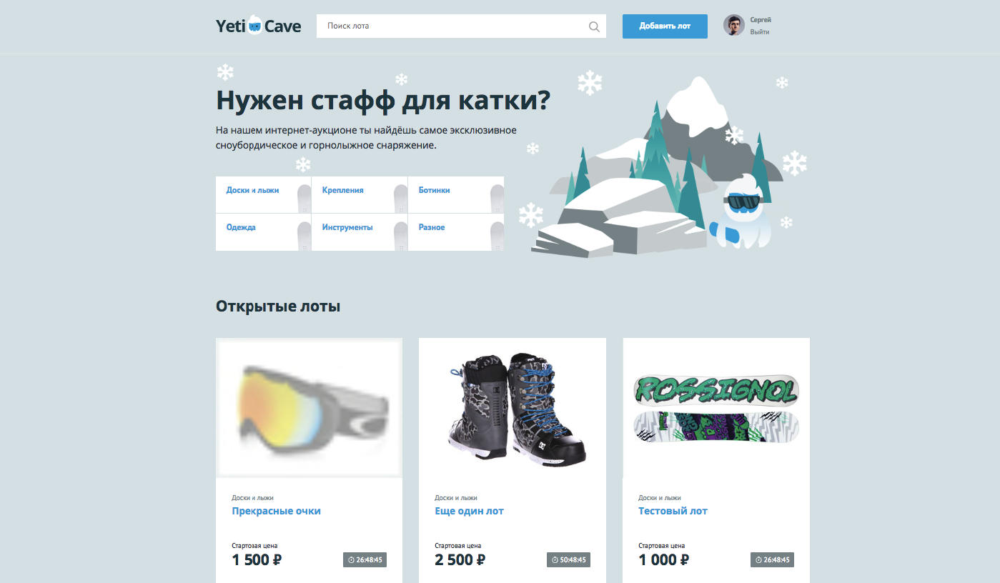
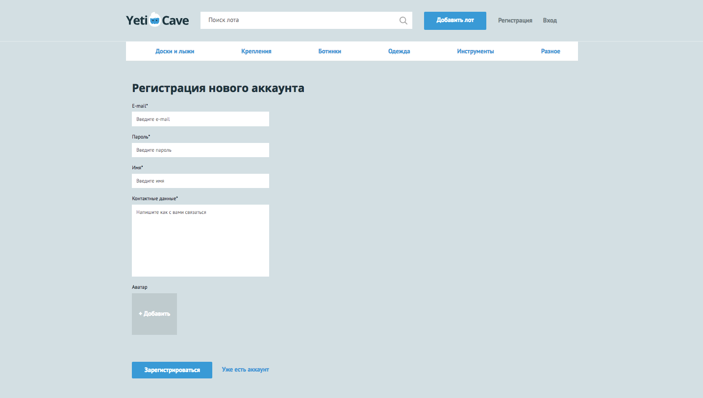
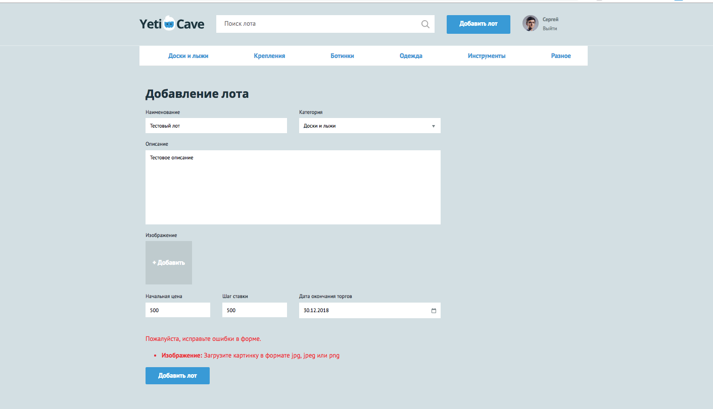
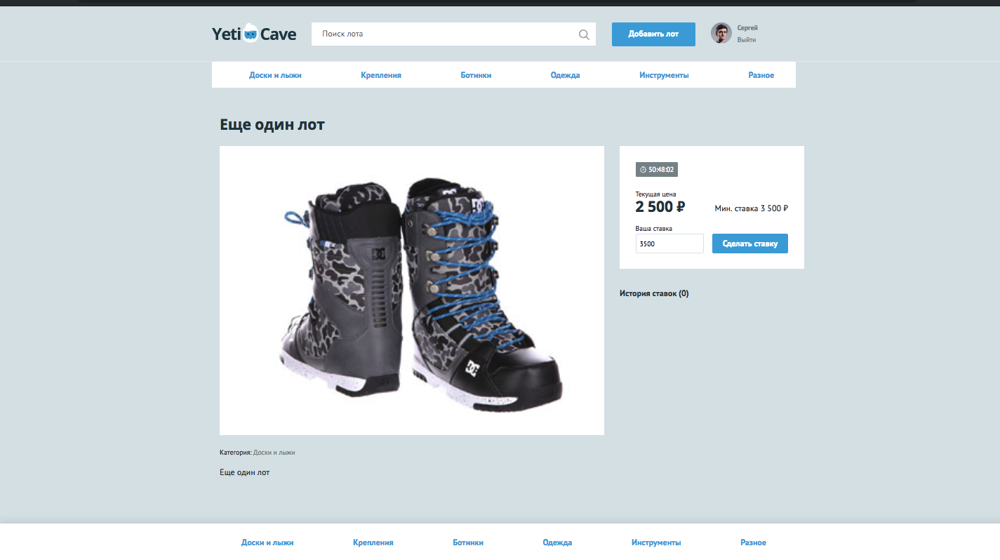

# Личный проект: «YetiCave»
### Автор: Шершнев Сергей
***
*Запуск проекта:*
1.  Клонируйте себе репозиторий следующей командой:

    `git clone git@github.com:Shv-sergey70/yeticave.git`
2.  Подключите внешние библиотеки через Composer командой:

    `composer install`
3.  Создайте схему базы данных - **импортируйте в PhpMyAdmin файл schema.sql**
4.  Заполните базы данных данными (необязательно) - **импортируйте в PhpMyAdmin файл queries.sql**
***
Интернет-аукцион «YetiCave» – это простой сервис, позволяющий пользователям продать свои личные вещи по максимально выгодной для них цене - на основе аукциона.

Пользователь, предложивший максимальную цену получает вещь по этой стоимости.

*Основные сценарии использования сайта:*

* Просмотр списка активных лотов;
* Публикация лота;
* Добавление ставок;
* Поиск лотов по категориям и названиям;
* Определение победителя на основе максимальной ставки

***
*Сайт состоит из следующих страниц:*

* Гостевая страница;
* Регистрация аккаунта;
* Авторизация на сайте;
* Лоты по категории;
* Результаты поиска;
* Добавление нового лота;
* Просмотр лота;
* Список моих ставок;

*Основные реализованные процессы:*

* Регистрация нового аккаунта;
* Авторизация на сайте;
* Лоты по категории;
* Добавление нового лота;
* Просмотр лота;
* Мои ставки;
* Полнотекстовый поиск по лотам;
* Определение победителя
***
Разработка бэкенда велась на языке программирования PHP 7.1, база данных – MySQL 5.7 + использование пакетного менеджера Сomposer.

*Использованные библиотеки:*
* Swiftmailer - отправка писем о предстоящих делах;
***
*Внешний вид сайта:*
* Главная страница

* Регистрация аккаунта

* Добавление лотов с валидацией

* Просмотр лота с возможностью сделать ставку

